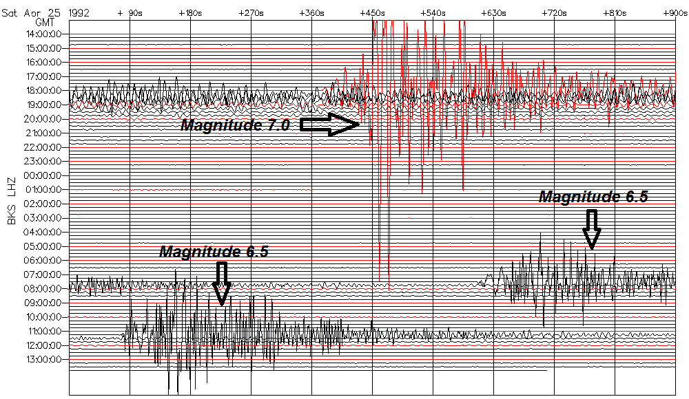
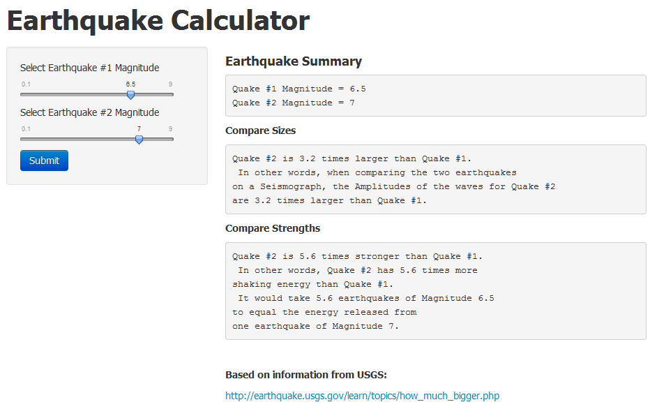

```{r echo = F, message = F, cache = F}
```
## Earthquake Seismograph: Cape Mendocino, California, April 25-26, 1992
<a href='http://quake.geo.berkeley.edu/bdsn/seismograms_of_interest.html'>The Seismograph</a> shows one Magnitude 7.0 quake, and two Magnitude 6.5 quakes.  How does Magnitude 7.0 compare to Magnitude 6.5?



--- .class #id 

## Compare Sizes

When comparing sizes of two quakes, use the relationship between wave Amplitude (A) and Magnitude (M):

Log10(A) is proportional to M

Compare sizes of the Magnitude 7.0 and 6.5 quakes:

```{r}

10^7.0 / 10^6.5

```
The Magnitude 7.0 quake is 3.2 times larger than a Magnitude 6.5 quake, in terms of the seismograph wave amplitudes.

--- .class #id 


## Compare Strengths

When comparing strengths of two quakes, use the relationship between Energy (E) and Magnitude (M) of an earthquake:

Log10(E) is proportional to 1.5*M

Compare strengths of the Magnitude 7.0 and 6.5 quakes:

```{r}

10^(1.5*7.0) / 10^(1.5*6.5)

```
The Magnitude 7.0 quake is 5.6 times stronger than a Magnitude 6.5 quake, in terms of destructive energy.

Let's make an app that compares the Sizes and Strengths of two earthquakes from their Magnitudes.

--- .class #id 

## Shiny App: Earthquake Comparisons 
1. Use the slider bars to select the two Magnitudes
2. Click "Submit"
3. The summary of the two Quakes is displayed on the right side


 

